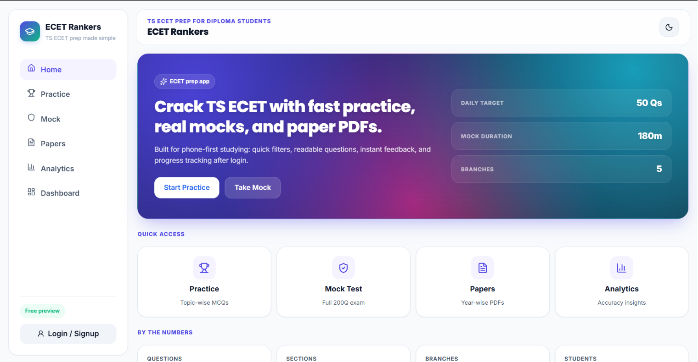
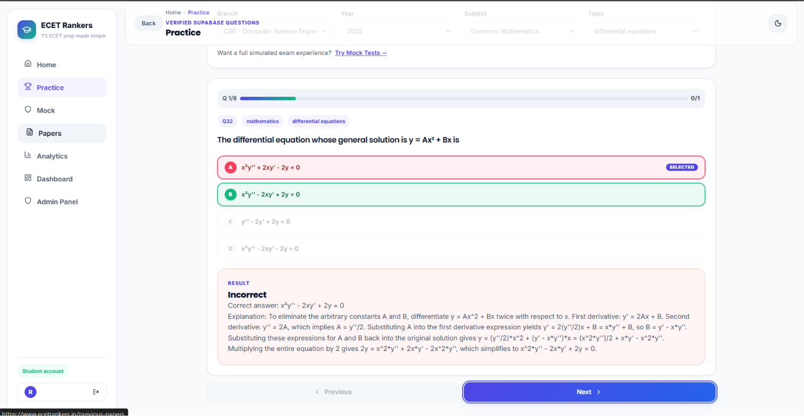
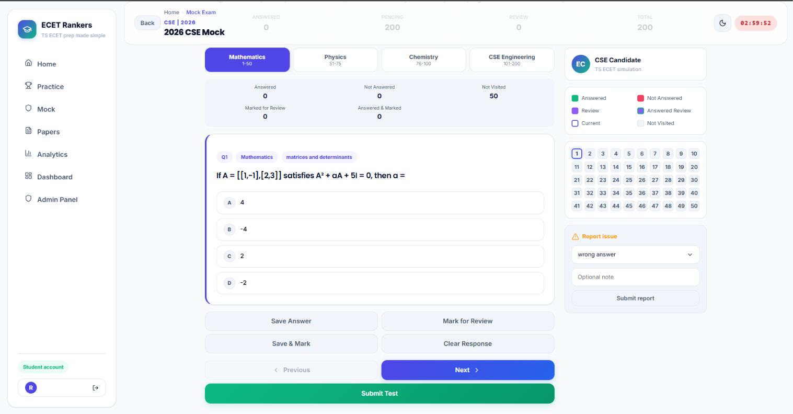
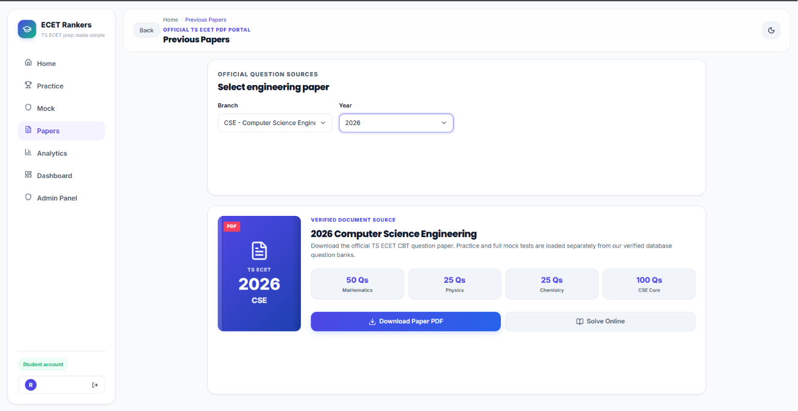
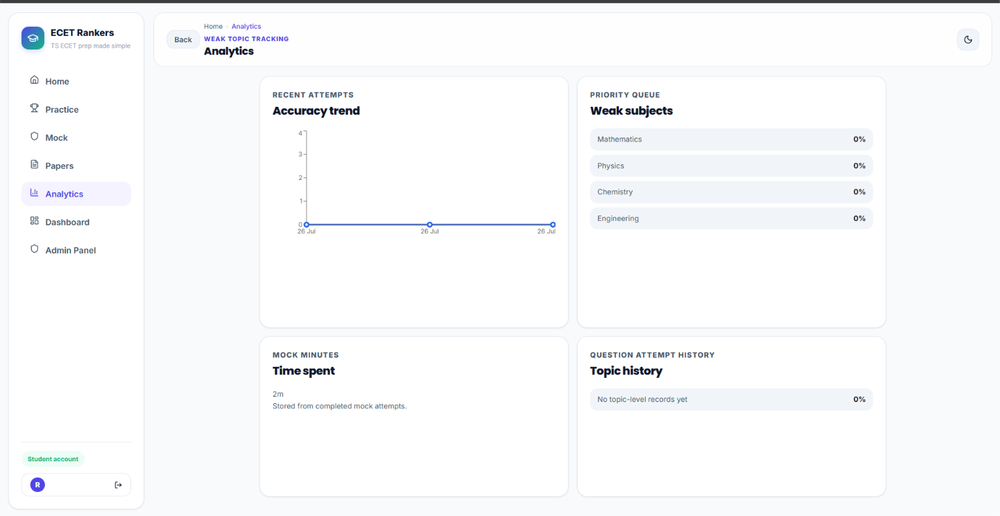
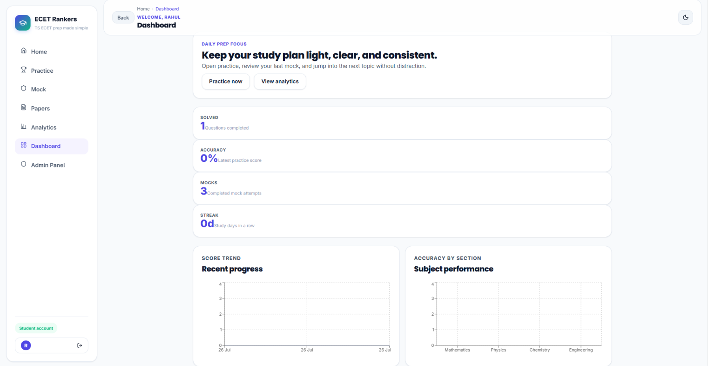
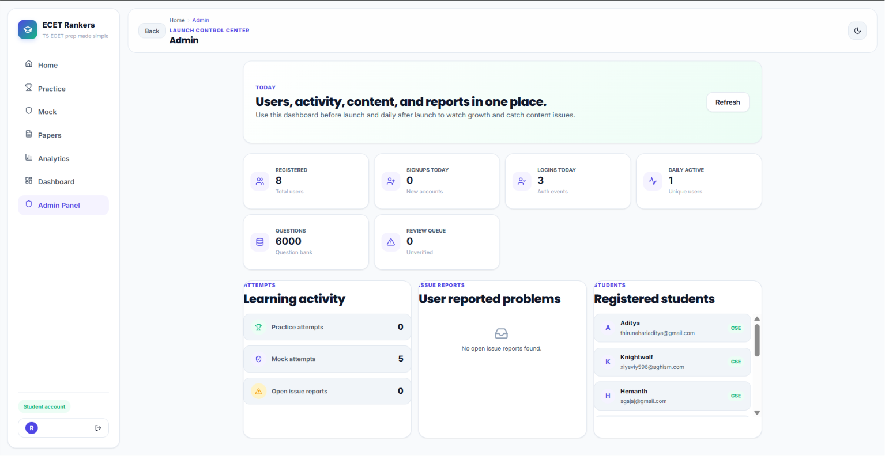
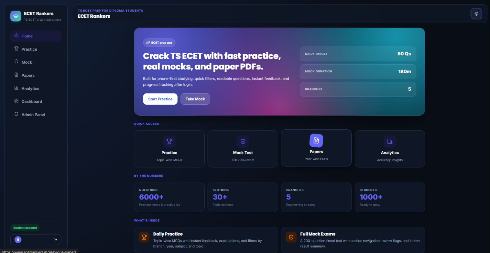
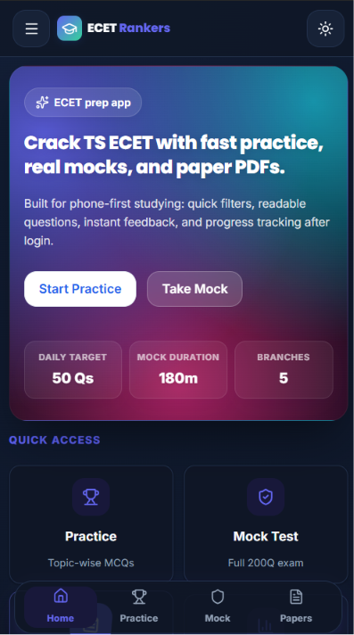

# 🎓 TS ECET Preparation Platform

> A modern, full-stack web platform for TS ECET aspirants to practice previous year questions, take CBT-style mock tests, and track their preparation progress.


---

# 📌 Live Demo

> https://ecetrankers.in

---

# 📖 About the Project

This project was built to provide TS ECET aspirants with a centralized preparation platform. Instead of switching between PDFs, notes, and multiple websites, students can practice questions, attempt CBT-style mock tests, monitor progress, and review previous papers from one place.

The application focuses on delivering a smooth user experience with a responsive interface backed by Supabase services.

---

# ✨ Features

## 📚 Question Bank
- Previous year questions
- Subject-wise filtering
- Topic-wise practice
- Difficulty grouping
- Answer explanations

## 📝 Mock Tests
- CBT-style interface
- Timer
- Question navigation
- Instant score
- Review mode

## 📊 Progress Tracking
- Performance analytics
- Accuracy tracking
- Completed questions
- Practice history

## 👤 Authentication
- User login
- Protected routes
- Session management

## 🛠 Admin
- Question management
- Import scripts
- OCR review workflow
- Database migration support

---

# 🧰 Tech Stack

## Frontend
- React 19
- TypeScript
- Vite
- Tailwind CSS

## Backend
- Supabase

## Database
- PostgreSQL (Supabase)

## Authentication
- Supabase Auth

## Deployment
- Vercel

## Other Tools
- ESLint
- npm
- Git
- GitHub

---
# 📸 Screenshots

### 🏠 Home & Practice

| Home | Practice |
|------|----------|
|  |  |

---

### 📝 Mock Test & Previous Papers

| Mock Test | Previous Papers |
|-----------|-----------------|
|  |  |

---

### 📊 Analytics & Dashboard

| Analytics | Dashboard |
|-----------|-----------|
|  |  |

---

### ⚙️ Admin Panel & Dark Theme

| Admin Panel | Dark Theme |
|-------------|------------|
|  |  |

---

### 📱 Mobile Preview

| Mobile Preview |
|----------------|
|  |

---

# 📂 Folder Structure

```text
.
├── public/
├── src/
│   ├── components/
│   ├── pages/
│   ├── hooks/
│   ├── contexts/
│   ├── services/
│   ├── utils/
│   ├── assets/
│   └── types/
├── scripts/
├── supabase/
│   ├── migrations/
│   └── functions/
├── docs/
├── package.json
├── vite.config.ts
└── README.md
```

---

# ⚙ Installation

```bash
git clone <repository-url>

cd project

npm install
```

---

# ▶ Running Locally

```bash
npm run dev
```

Production build

```bash
npm run build
```

Preview

```bash
npm run preview
```

---

# 🔐 Environment Variables

```env
VITE_SUPABASE_URL=
VITE_SUPABASE_ANON_KEY=
```

---


---

# 🚧 Challenges Faced

- Structuring large question datasets
- Maintaining responsive CBT experience
- Managing authentication state
- Optimizing database queries
- Importing and validating question data

---

# 📚 What I Learned

Building this project helped me understand how to design and develop a production-style web application using React and Supabase. I gained practical experience with authentication, database design, reusable component architecture, state management, responsive UI development, deployment, and organizing a scalable codebase.

---

# 🚀 Future Improvements

- AI-assisted explanations
- Bookmark questions
- Leaderboard
- Personalized recommendations
- Offline mode
- Performance insights
- Multi-language support

---

# ☁ Deployment

The application is configured for deployment on **Vercel**, while **Supabase** provides the backend services.

---

# 👨‍💻 Author

**Pulipati Rahul**

Full Stack Developer

GitHub:
https://github.com/Pulipati-Rahul

LinkedIn:
https://www.linkedin.com/in/pulipatirahul

Portfolio:
https://pulipatirahul.vercel.app

---

# ⭐ Support

If you found this project helpful, consider giving it a ⭐ on GitHub.

It motivates me to continue building high-quality projects.

                             
